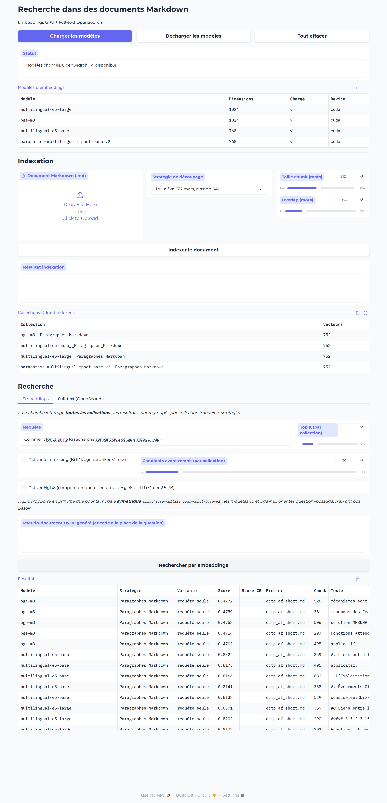

# Recherche dans des documents Markdown — Embeddings + Full-text

Banc d'essai de recherche documentaire pour **comparer** la recherche
**sémantique** (embeddings, plusieurs modèles et stratégies de découpage) et la
recherche **plein texte** (OpenSearch), avec **reranking** (cross-encoder) et
**HyDE** (LLM) optionnels.

Interface **Gradio** + **Qdrant** (base vectorielle) + **OpenSearch** (full-text),
le tout orchestré par **Docker**.



## Démarrage rapide

```bash
docker compose up -d                 # Qdrant (6333) + OpenSearch (9200) + Dashboards (5601)
python3 -m venv .venv && source .venv/bin/activate
pip install -r requirements.txt
python -m spacy download fr_core_news_md
./run.sh                             # http://localhost:7860
```

## Documentation

- **[INSTALLATION.md](INSTALLATION.md)** — installation détaillée (WSL + Docker).
- **[FONCTIONNEMENT.md](FONCTIONNEMENT.md)** — architecture et fonctionnement.

## Fonctionnalités

- Indexation de `.md` avec **4 stratégies de découpage** et **4 modèles d'embeddings** multilingues.
- Recherche **embeddings multi-collections** (Top K par collection, regroupé par modèle × stratégie).
- **Reranking** par cross-encoder `BAAI/bge-reranker-v2-m3`.
- **HyDE** (`Qwen/Qwen2.5-7B-Instruct`) avec comparaison *avec / sans*.
- Recherche **full-text** OpenSearch au niveau chunk (comparable aux embeddings).
- Consoles d'inspection : **Qdrant** (`:6333/dashboard`) et **OpenSearch Dashboards** (`:5601`).
- Chargement / déchargement des modèles à la demande (gestion de la VRAM).

## Ports

| Service | Port |
|---|---|
| Application (Gradio) | 7860 |
| Qdrant (REST / dashboard) | 6333 |
| OpenSearch | 9200 |
| OpenSearch Dashboards | 5601 |
